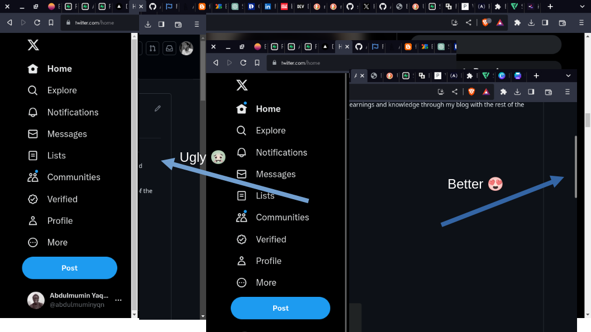

# SleekScroll

Bid farewell to ugly looking scrollbar. With a focus on modern aesthetics, SleekScroll empowers you to create a browsing experience that's as elegant as it is functional.

<!-- # SleekScroll

Enhance your browsing experience with custom-designed scrollbars using SleekScroll. Sculpt your scrollbar aesthetics to match your style and bring a touch of elegance to every scroll. -->

## Features

- Escape the ugly scrollbars with ease.
- Choose from a range of predefined themes or customize your own (coming soon ..).
- Enjoy a smooth and engaging scrolling experience.
- Compatible with all Chromium-based browsers.

## Installation

1. [Download the extension](link-to-extension-package)
2. Goto step 4, if you just clone the repository.
3. Unzip the package.
4. Open your Chromium-based browser (e.g., Chrome, Brave).
5. Go to the extension tab (e.g `chrome://extensions/`).
6. Enable "Developer mode".
7. Click "Load unpacked" and select the unzipped folder.

## Contributing

Contributions are welcome! If you'd like to contribute to SleekScroll, follow these steps:

1. Fork the repository.
2. Create a new branch.
3. Make your changes and commit them.
4. Push your changes to your forked repository.
5. Create a pull request explaining your changes.

## License

This project is licensed under the [MIT License](LICENSE).

## Contact

For questions or support, you can reach out to [abdulmuminyqn@gmail.com](mailto:abdulmuminyqn@gmail.com).

## Acknowledgements

SleekScroll was inspired by the desire to enhance my browsing experience, I couldn't stand the ugly default scrollbar anymore 🤢!
